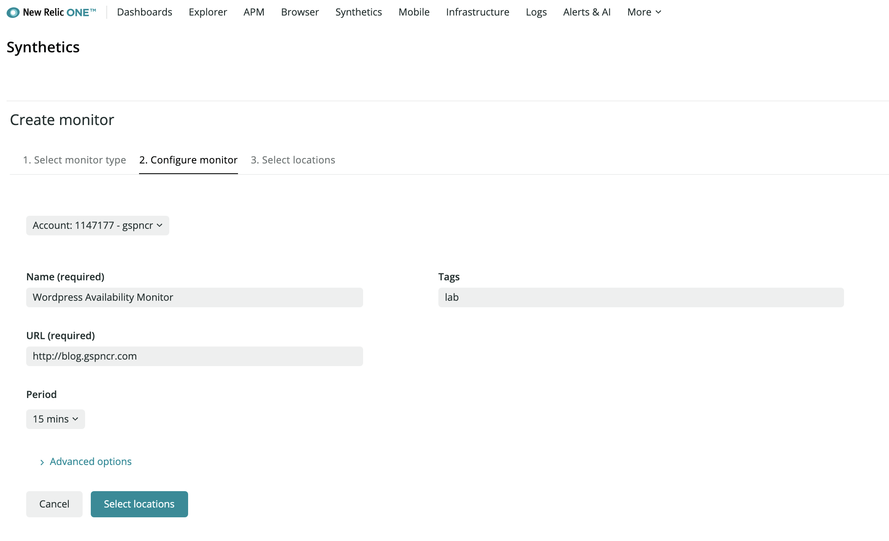
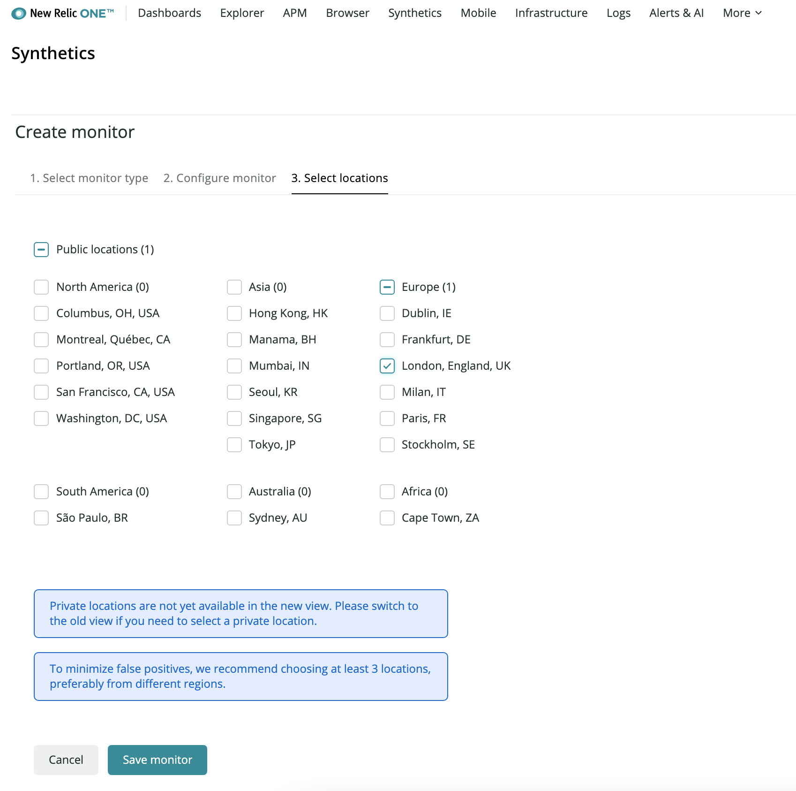
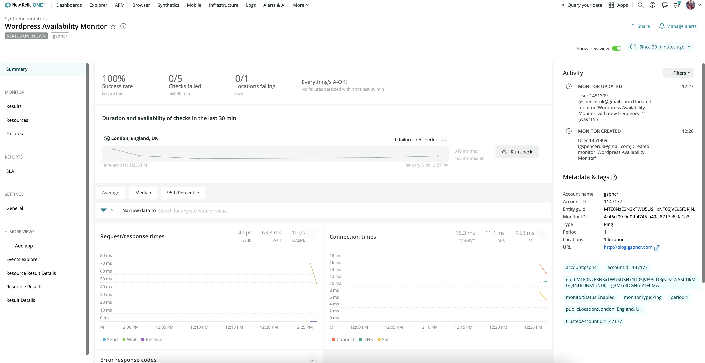
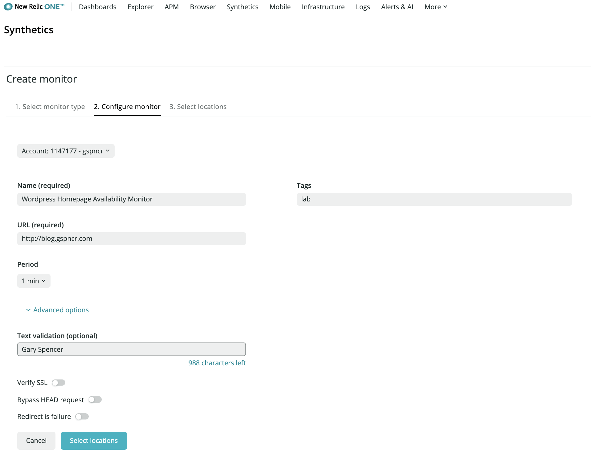
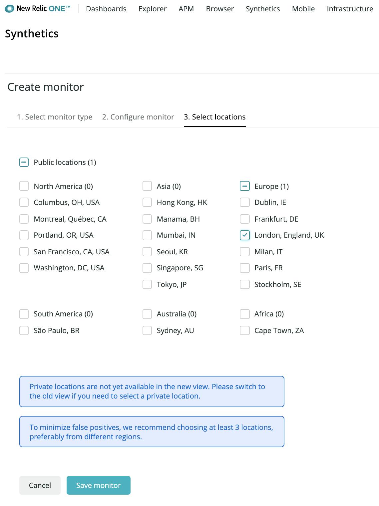
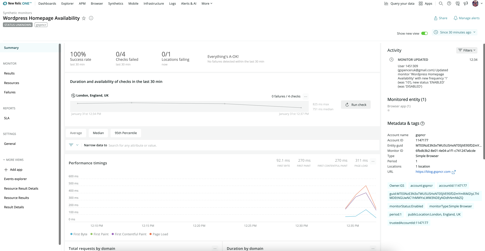

New Relic Synthetics allows you to learn about problems before your customers do. Reactive management has business impact including revenue loss, brand dilution, and unhappy customers.

# Step 1: Creating a simple ping test
A ping monitor is used to track up/down availability.

In [New Relic Synthetics](https://synthetics.newrelic.com/), select *Create monitor*. Select *Availability* for the monitor type.


Give your monitor some meaningful name. Include the URL of the blog you created. Select a time period for how frequently the monitor should run.
There is an optional step to add tags at this point. You can also extend the *Advanced Options* to add verification steps.


Select a monitoring location, or many. At this point select Do not notify anyone. And save your monitor


You will be redirected to the monitor summary page. You will see results shortly, depending on the frequency of the monitor.


# Step 2: Creating a simple browser test
A simple browser test loads a full page of a given URL. This provides deep data insight such as a breakdown of page resources and timelines.

In New Relic Synthetics, select *Create monitor*. Select *Page load performance* for the monitor type.


Give your monitor some meaningful name. Include the URL of the blog you created. Set the frequency for the monitor to run.
At this point you should also expand the *Advanced Options* and validate the presence of some text on your blogs homepage.


Select a monitoring location, or many (be mindful of your consumption). And create your monitor.


You will be redirected to the monitor summary page. You will see results shortly, depending on the frequency of the monitor.


# Step 3: Creating a scripted browser test
A scripted browser test lets you test key workflows for your website. Scripted monitors are powered by Selenium WebDriverJS. Each time your script runs, Synthetics creates a Selenium-driven Google Chrome browser that navigates your website and follows each step of the script.

For this lab, we will use Katalon recorder to generate the script for us. First up, [download the Katalon recorder for Google Chrome](https://chrome.google.com/webstore/detail/katalon-recorder/ljdobmomdgdljniojadhoplhkpialdid).


After installing the Katalon recorder in Google Chrome select the plugin (the green K icon) which opens the Katalon recorder, then select Record and then in your browser tab, navigate to your Wordpress blog and perform a search for the Hello World post.


Observe that while navigating your Wordpress instance, your clicks are registered by Katalon recorder. Once you are done close the tab and return to the Katalon recorder.


Now you have finished recording your script, select export and select New Relic from the export options. You can copy this script to your clipboard.


Now in new Relic Synthetics, create a scripted browser test and click through to upload a script. When prompted, paste the script from your Katalon recorder into the New Relic UI. Select a node and choose to validate. A successful validation will return a green tick ✅ along with some output and a screenshot, similar to below. Important: when you are recording your script, make sure you are not logged into Wordpress since the Synthetic node in this test example will not be logged in and therefore your test will fail.


If your validation is successful as above, create the monitor.


After some time, you will have results coming in.

# Step 4: Analysing the results
In the slowest results section you can find individual executions that took the longest in the timeframe.

Using instructions on the [New Relic Synthetics Docs](https://docs.newrelic.com/docs/synthetics/new-relic-synthetics/using-monitors/view-monitor-results), answer:
1. Which page takes the longest time to complete, why?
2. What are the slowest resources on each page, and why?
3. What is the difference between the time taken loading the homepage, until the search results?
4. Are there any performance improvements that could be made, or are the pages as optimised as they could be?

*Answers will be required in the lab review and self assessment form.*

# Step 5: Using custom attributes in Synthetics
For this activity we will check the latest news from the [UK Government Food Agency](https://food.gov.uk/). The food agency publishes an [RSS feed with the latest allergy alerts](https://food.gov.uk/rss-feed/alerts-allergy). We will be using the results of this later in the alerting lab.

This exercise will involve [adding custom attributes to Synthetics](https://docs.newrelic.com/docs/synthetics/new-relic-synthetics/scripting-monitors/add-custom-attributes-new-relic-synthetics-data) to capture new alerts. We will use the [$util.insights](https://docs.newrelic.com/docs/synthetics/new-relic-synthetics/scripting-monitors/add-custom-attributes-new-relic-synthetics-data#h2-functions) functions in the Synthetics check.

This activity involves:
1. Create a Synthetics API Check to query the RSS feed for allergy alerts
2. Extract from the latest entry the title, description, and publication date and forward this information to Insights using $util.insights

Use the below for a new scripted browser test:
```javascript
var parseString = require('xml2js').parseString;
var $http = require('request');
 
// Get the New Relic status RSS feed
$http.get('https://www.food.gov.uk/rss-feed/alerts-allergy', function(err, response, body) {
  parseString(body, function(err, result){
    // Parse the RSS, and get the latest incident
    var latestIncident = result.rss.channel[0].item[0];
    
    // Push the incident details to Insights
    $util.insights.set('newsTitle', latestIncident.title[0]);
    $util.insights.set('Description', latestIncident.description[0]);
    $util.insights.set('Date', latestIncident.pubDate[0]);

    console.log(latestIncident.title[0]);
    console.log(latestIncident.description[0]);
    console.log(latestIncident.pubDate[0]);
  });
});
```

# Step 6: Viewing custom attributes results
Discover yourself the following:
1. Where in Synthetics can you view the custom attributes results?
2. How can you view the results of the custom attributes from this test in Insights?
3. What Insights query can you run to get the latest title of a food allergy alert?

*Answers will be required in the lab review and self assessment form.*
